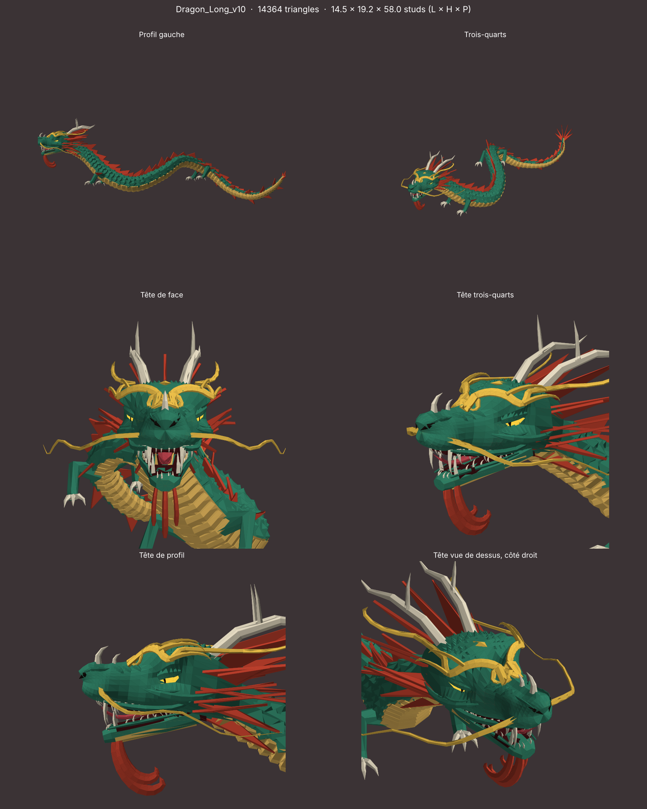

# Dragon Long (dragon chinois stylisé)

Modèle low-poly à facettes pour Roblox, inspiré du dragon chinois (Long) : corps de serpent en S,
ventre doré, crinière et épines rouges, cornes en bois de cerf, moustaches, 4 pattes à 3 griffes, yeux qui brillent.



Comparaisons : [museau v9 / v10](comparaison-nez-Dragon_Long_v9-Dragon_Long_v10.png) · [gueule v9 / v10](comparaison-gueule-Dragon_Long_v9-Dragon_Long_v10.png) · [gueule v8 / v9](comparaison-gueule-Dragon_Long_v8-Dragon_Long_v9.png) · [nez v7 / v8](comparaison-nez-Dragon_Long_v7-Dragon_Long_v8.png) · [nez v4 / v7](comparaison-nez-Dragon_Long_v4-Dragon_Long_v7.png) · [yeux v6 / v7](comparaison-yeux-Dragon_Long_v6-Dragon_Long_v7.png) · [nez v4 / v5](comparaison-nez-Dragon_Long_v4-Dragon_Long_v5.png) · [yeux v5 / v6](comparaison-yeux-Dragon_Long_v5-Dragon_Long_v6.png) · [nez v5 / v6](comparaison-nez-Dragon_Long_v5-Dragon_Long_v6.png)

| Version | Fichier | Triangles | Nouveautés |
|---|---|---|---|
| **v10** (actuelle) | `objets/Dragon_Long_v10.glb` | 14 364 | museau affiné : −26 % en largeur et −20 % en hauteur par le dessus, avec une transition douce après les yeux ; mâchoire, lèvres, dents, langue et départ des moustaches suivent (réglable avec `MUZZLE_W` et `MUZZLE_H`) |
| v9 | `objets/Dragon_Long_v9.glb` | 14 364 | intérieur de la gueule (gorge sombre, palais à bourrelets, plancher), langue fendue, dentition acérée : dents fines à 3 arêtes recourbées vers la gorge, longues et courtes en alternance, crocs en poignard en haut et en bas, incisives pointues ([aperçu](apercu-Dragon_Long_v9.png)) |
| v8 | `objets/Dragon_Long_v8.glb` | 13 198 | nez agressif : arête tranchante sur le museau (dans le prolongement du pli entre les arcades), corne de nez + une plus petite, narines en fentes inclinées comme le V des arcades avec ailes évasées, rides en chevrons, bout du museau plus crochu ([aperçu](apercu-Dragon_Long_v8.png)) |
| v7 | `objets/Dragon_Long_v7.glb` | 12 956 | nez de la v4 (museau fondu, coussinets, narines en virgule, rides du museau) + toute la zone des yeux de la v6 ([aperçu](apercu-Dragon_Long_v7.png)) |
| v6 | `objets/Dragon_Long_v6.glb` | 13 730 | zone des yeux : arcades massives en V froncé dont la pointe descend sur le nez, pli profond entre elles, yeux en amande étroits enfoncés et mi-clos sous une paupière lourde (toujours visibles de face), poche à 2 plis sous chaque œil, pommettes saillantes vers l'arrière, front couvert d'écailles en losange ; sourcils dorés en volutes reposés sur l'arcade ; narines creusées vers l'intérieur ([aperçu](apercu-Dragon_Long_v6.png)) |
| v5 | `objets/Dragon_Long_v5.glb` | 12 952 | à partir de la v4, **seul le nez change** : truffe large et bombée fondue dans le crâne, sillon vertical qui la sépare en 2 lobes, 2 grosses narines rondes avec bourrelet et creux sombre, coussinets de lèvre d'où partent les moustaches, chanfrein court avec 3 plis et des écailles qui rapetissent jusqu'à disparaître ([aperçu](apercu-Dragon_Long_v5.png)) |
| v5_gueule (essai mis de côté) | `objets/Dragon_Long_v5_gueule.glb` | 12 928 | gueule habitée : gorge sombre, palais à bourrelets, langue fendue, rangées de dents en haut et en bas avec incisives ; yeux plus grands et tournés vers l'avant pour être vus de face ([aperçu](apercu-Dragon_Long_v5_gueule.png)) — pas reprise dans la v5 |
| v4 | `objets/Dragon_Long_v4.glb` | 11 986 | nez fondu dans le crâne : truffe, coussinets et sillon sculptés dans la même peau ; yeux enfoncés dans des orbites sous une arcade, avec pommettes ([aperçu](apercu-Dragon_Long_v4.png)) |
| v3 | `objets/Dragon_Long_v3.glb` | 11 396 | tête plus grande (×1,3) et sculptée : nez de félin (truffe, narines, coussinets des moustaches, rides du chanfrein), sourcils dorés en volutes, barbichette, pommettes et joues en flammes, lèvres, marque dorée sur le front ([aperçu](apercu-Dragon_Long_v3.png)) |
| v2 | `objets/Dragon_Long_v2.glb` | 8 896 | écailles en relief sur le dos, plaques sur le ventre, crête de triangles plus fournie, yeux en amande avec pupille fendue, paupières et arcades ([aperçu](apercu-Dragon_Long_v2.png)) |
| v1 | `objets/Dragon_Long_v1.glb` | 3 032 | premier croquis ([aperçu](apercu-Dragon_Long_v1.png)) |

- Taille : 14,5 × 19 × 58 studs
- **Couleurs et matériaux** de chaque partie : `objets/manifest.json`

| Partie | Couleur | Matériau |
|---|---|---|
| Body | `#2F7D63` jade | SmoothPlastic |
| Belly | `#E2B65C` doré | SmoothPlastic |
| Fins (crinière, crête ; à partir de la v3, aussi la barbichette) | `#C8432F` rouge | SmoothPlastic |
| Horns (cornes, griffes, dents) | `#E6DCC3` ivoire | SmoothPlastic |
| Whiskers (moustaches ; à partir de la v3, aussi les sourcils et la marque du front) | `#F0C24B` or | SmoothPlastic |
| Eyes | `#FFD23F` | **Neon** |
| Pupils (pupilles ; à partir de la v3, aussi les narines ; en v5, le creux des narines) | `#17120E` presque noir | SmoothPlastic |
| Mouth (v5_gueule et v9 : gorge, palais) | `#3A1013` rouge très sombre | SmoothPlastic |
| Tongue (v5_gueule et v9 : langue) | `#B9434C` rouge rosé | SmoothPlastic |

## Import dans Roblox Studio
**Avatar → Import 3D**, unité **Stud**, parties séparées. Le pivot est sous le dragon (Y = 0) et la tête regarde vers +Z.
Pour les nageoires, mettre `DoubleSided = true` si elles disparaissent sous certains angles.

## Comparer deux versions
```
cd dragon-long/generateur && python compare.py Dragon_Long_v5 Dragon_Long_v6 yeux   # ou nez, gueule
```

## Régénérer
```
pip install numpy trimesh matplotlib scipy
cd dragon-long/generateur && python build.py
```
La forme se règle dans `dragon_long.py` : `SPINE` (la ligne du dos), `body_radius` (l'épaisseur), `COULEURS`.
