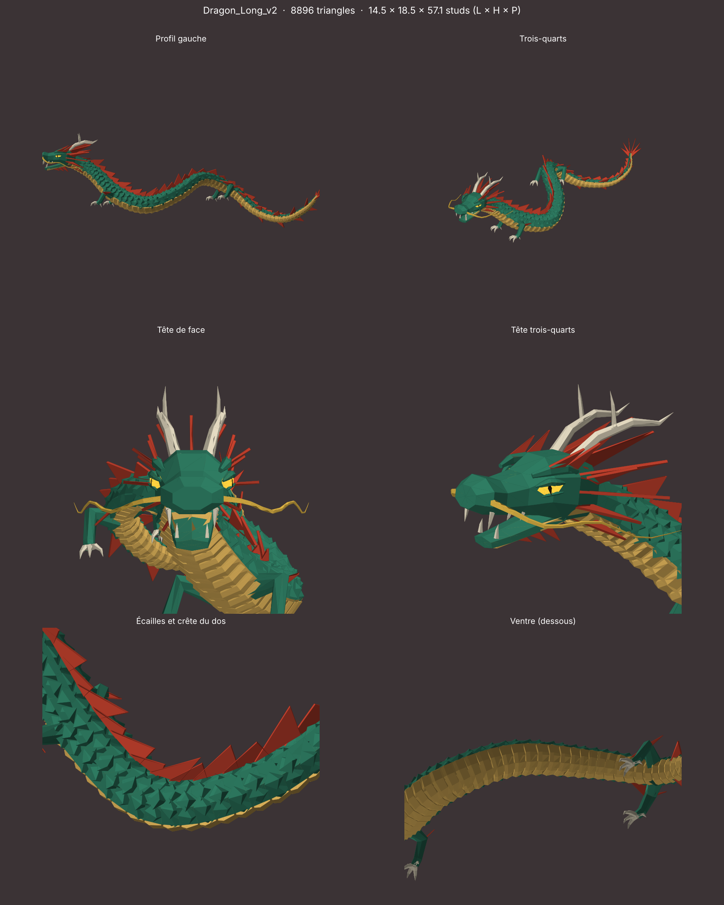

# Dragon Long (dragon chinois stylisé)

Modèle low-poly à facettes pour Roblox, inspiré du dragon chinois (Long) : corps de serpent en S,
ventre doré, crinière et épines rouges, cornes en bois de cerf, moustaches, 4 pattes à 3 griffes, yeux qui brillent.



| Version | Fichier | Triangles | Nouveautés |
|---|---|---|---|
| **v2** (actuelle) | `objets/Dragon_Long_v2.glb` | 8 896 | écailles en relief sur le dos, plaques sur le ventre, crête de triangles plus fournie, yeux en amande avec pupille fendue, paupières et arcades |
| v1 | `objets/Dragon_Long_v1.glb` | 3 032 | premier croquis ([aperçu](apercu-Dragon_Long_v1.png)) |

- Taille : 14,5 × 18,5 × 57 studs
- **Couleurs et matériaux** de chaque partie : `objets/manifest.json`

| Partie | Couleur | Matériau |
|---|---|---|
| Body | `#2F7D63` jade | SmoothPlastic |
| Belly | `#E2B65C` doré | SmoothPlastic |
| Fins | `#C8432F` rouge | SmoothPlastic |
| Horns (cornes, griffes, dents) | `#E6DCC3` ivoire | SmoothPlastic |
| Whiskers | `#F0C24B` or | SmoothPlastic |
| Eyes | `#FFD23F` | **Neon** |
| Pupils (v2) | `#17120E` presque noir | SmoothPlastic |

## Import dans Roblox Studio
**Avatar → Import 3D**, unité **Stud**, parties séparées. Le pivot est sous le dragon (Y = 0) et la tête regarde vers +Z.
Pour les nageoires, mettre `DoubleSided = true` si elles disparaissent sous certains angles.

## Régénérer
```
pip install numpy trimesh matplotlib scipy
cd dragon-long/generateur && python build.py
```
La forme se règle dans `dragon_long.py` : `SPINE` (la ligne du dos), `body_radius` (l'épaisseur), `COULEURS`.
